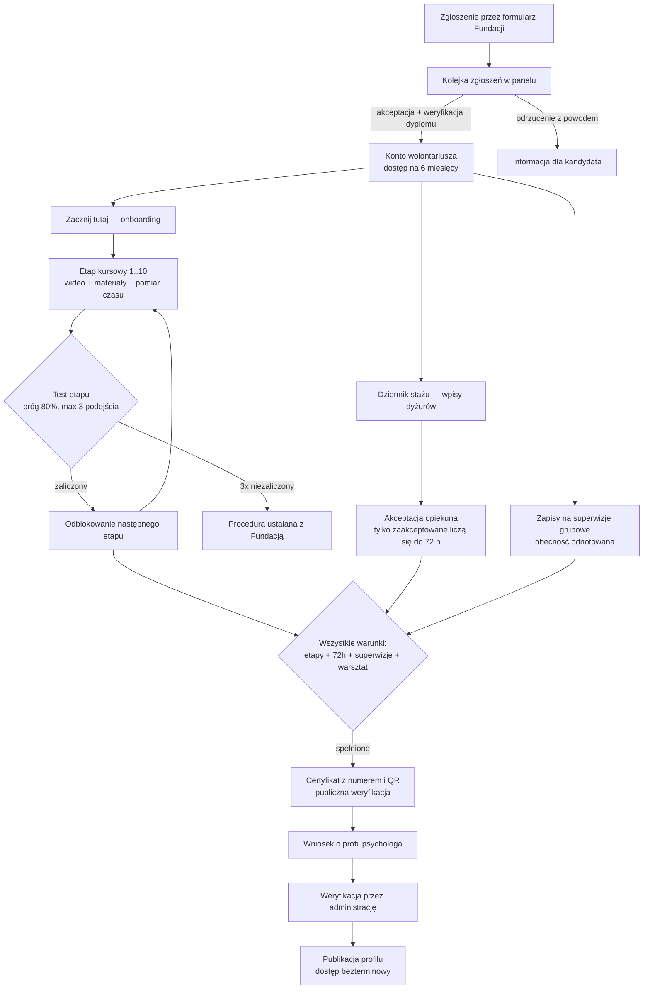

# Platforma Niepodzielni — wprowadzenie i słownik

Dokumentacja systemu dla zespołu programistycznego. Jest **samowystarczalna**: do rozpoczęcia
pracy nie jest potrzebny żaden istniejący kod. Punktem odniesienia funkcjonalnym jest
klikalna makieta (https://fundacja-niepodzielni.github.io/psychon-makieta/) oraz rozpiska
modułów programu; niniejsza dokumentacja przekłada je na wymagania techniczne.

Struktura dokumentacji:

| Plik | Zawartość |
|---|---|
| `00-wprowadzenie-i-slownik.md` | ten plik — kontekst, aktorzy, główny przepływ, słownik |
| `01-architektura-i-integracje.md` | architektura, środowiska, integracje zewnętrzne, decyzje otwarte |
| `02-model-danych.md` | encje, relacje, diagram ERD, retencja danych |
| `03-role-i-uprawnienia.md` | matryca uprawnień pięciu ról |
| `04-specyfikacja-modulow-mvp.md` | wymagania funkcjonalne modułów pierwszego wdrożenia |
| `05-specyfikacja-fazy-2.md` | wersja docelowa (wydarzenia live, DOBROstan, integracje) |
| `06-wymagania-niefunkcjonalne.md` | bezpieczeństwo, RODO, WCAG 2.1 AA, wydajność, kopie, odbiór |

---

## 1. Czym jest system

Platforma szkoleniowa **Fundacji Niepodzielni** do prowadzenia programu rozwojowego dla
psychologów-wolontariuszy. Program ma stałą strukturę:

> rekrutacja → nauka (10 etapów kursowych, ~60 h wideo) → testy po etapach →
> staż 72 h dyżurów → superwizje grupowe → warsztat stacjonarny → **certyfikat** →
> publikacja profilu psychologa → współpraca z Fundacją

Kluczowe cechy odróżniające od typowej platformy e-learningowej:

1. **Zamknięty nabór** — nie ma samodzielnej rejestracji. Kandydat przechodzi formularz
   zgłoszeniowy i ręczną weryfikację (m.in. dyplomu psychologii); konto zakłada administracja.
2. **Udział bezpłatny** — w MVP nie ma płatności, cen ani koszyka. Moduł sprzedaży ma być
   *wyłączony flagą konfiguracyjną*, nie usunięty koncepcyjnie (może wrócić; osobny produkt
   DOBROstan w fazie 2 ma płatną subskrypcję).
3. **Rzetelność, nie tylko postęp** — system mierzy realny czas nauki (odrzuca czas przy
   nieaktywnej karcie), wymusza sekwencję etapów, próg 80% na testach i limit 3 podejść.
4. **Rozliczalność** — każda decyzja administracyjna (akceptacja dyplomu, wpisu stażu,
   profilu, wydanie certyfikatu) trafia do niezmienialnego dziennika działań. Platforma
   rozlicza program przed grantodawcą.
5. **Dostępność cyfrowa** — wymóg WCAG 2.1 AA potwierdzony przez Fundację.
6. **Dane wrażliwe** — PESEL i adres (umowy), skany dyplomów, zaświadczenia o niekaralności,
   opisy dyżurów. RODO traktowane jako wymaganie projektowe, nie dodatek.

## 2. Aktorzy (role)

| Rola | Kim jest | Co widzi |
|---|---|---|
| **Super Admin** | zarząd / administrator główny | całość systemu, w tym moduły finansowe (faza 2) |
| **Opiekun Projektu** | zespół operacyjny Fundacji | treści, zgłoszenia, akceptacje, statystyki — bez finansów |
| **Psycholog prowadzący** | prowadzi etap/kurs i grupę superwizyjną | swoja grupa, swoje kursy, pytania od uczestników |
| **Wolontariusz** | uczestnik pełnego programu | pełna ścieżka: kursy, testy, staż, superwizja, certyfikat, profil |
| **Student** | uczestnik węższej ścieżki | kursy i wydarzenia, bez stażu/superwizji/certyfikatu zawodowego |
| Gość (niezalogowany) | internet | strona logowania, publiczna weryfikacja certyfikatu, (faza 2: strony publiczne) |

Szczegółowa matryca uprawnień: `03-role-i-uprawnienia.md`.

## 3. Główny przepływ uczestnika (happy path)

Każde przejście oznaczone decyzją administracji zapisuje wpis w dzienniku działań.

## 4. Produkty na platformie

- **Program PsychON (MVP)** — opisany wyżej; grupa produktowa „Psycho".
- **DOBROstan (faza 2)** — drugi produkt: subskrypcja 35 zł/mc, miesiące tematyczne,
  karty pracy, webinar miesiąca. Osobne wejście i menu, wspólna infrastruktura kont.
  Model danych od początku przewiduje pole *grupy produktowej* przy kursach i kontach.

## 5. Wersje zakresu

- **MVP** — zakres pierwszej edycji programu; pozycje ✅ (zachowanie ustalone w makiecie)
  i 🔷 (uzgodnione, poza makietą — np. hashowanie haseł, weryfikacja uprawnień na serwerze,
  realna wysyłka e-maili, WCAG).
- **Wersja docelowa (faza 2)** — pozycje 🔵: wydarzenia na żywo, DOBROstan i mailing,
  współpraca po programie, integracja API z bazą psychologów, formularz rekrutacyjny
  na platformie.
- **Pozycje ⚠️** — czekają na decyzję Fundacji; lista z przypisaniem do iteracji
  w `01-architektura-i-integracje.md` §5 i w planie iteracji.

## 6. Słownik pojęć

| Pojęcie | Definicja |
|---|---|
| **Edycja** | jeden cykl programu (nabór → certyfikaty) z własnymi terminami, limitem miejsc i numeracją certyfikatów; MVP obsługuje jedną edycję naraz (obsługa równoległa = ⚠️) |
| **Etap** | kurs w sekwencji programu; kolejny odblokowuje się po zaliczeniu testu poprzedniego |
| **Lekcja** | jednostka nauki wewnątrz etapu: wideo + opis + materiały do pobrania |
| **Rzetelność** | stosunek zmierzonego czasu nauki do oczekiwanego czasu materiału; próg konfigurowalny (domyślnie 60%) |
| **Wpis stażu** | pojedynczy dyżur: data, godziny, forma, liczba konsultacji, opis (bez danych osób konsultowanych) |
| **Superwizja** | grupowe spotkanie z psychologiem prowadzącym; obecności liczą się do warunku certyfikatu |
| **Warsztat stacjonarny** | zaliczenie końcowe poza platformą; administracja odznacza je ręcznie |
| **Warunki certyfikatu** | komplet: wszystkie etapy + test każdego etapu + 72 h zaakceptowanego stażu + wymagane superwizje + warsztat |
| **Profil psychologa** | publikowana sylwetka absolwenta (specjalizacje, nurt, miasto, opis) po weryfikacji dokumentów |
| **Dziennik działań** | niezmienialny rejestr decyzji administracyjnych (audit log) |
| **Dostęp czasowy** | konto uczestnika wygasa po 6 miesiącach; po ukończeniu programu ograniczenie znika |
| **Grupa produktowa** | PsychON („Psycho") albo DOBROstan — rozdziela treści i nawigację |
