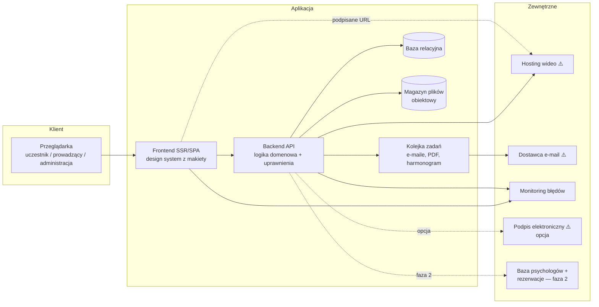

# Architektura, środowiska i integracje

Dokument opisuje wymagania architektoniczne. Tam, gdzie wybór technologii nie wpływa na
zakres, decyzja należy do wykonawcy — pod warunkiem spełnienia wymagań z §1.
Rekomendacje (§2) wskazują sprawdzoną drogę, nie jedyną.

---

## 1. Wymagania architektoniczne (obowiązkowe)

1. **Aplikacja webowa, responsywna** (desktop + telefon), w języku polskim; bez aplikacji
   natywnych.
2. **Uprawnienia egzekwowane po stronie serwera** przy każdym żądaniu. Ukrycie elementu
   w menu ani strażnik w przeglądarce nie jest zabezpieczeniem.
3. **Relacyjna baza danych** z migracjami wersjonowanymi w repozytorium; model danych
   projektowany całościowo na starcie (patrz `02-model-danych.md`).
4. **Dziennik działań** (audit log) zapisywany w tej samej transakcji co decyzja, którą
   dokumentuje; wpisy niemodyfikowalne i nieusuwalne z poziomu aplikacji.
5. **Zadania w tle i harmonogram**: wysyłka e-maili, generowanie PDF, wygaszanie dostępu
   po terminie — poza cyklem żądanie–odpowiedź.
6. **Wideo przez wyspecjalizowanego dostawcę** (nie pliki na własnym serwerze WWW);
   adresy strumieni podpisane i wygasające; identyfikatory nagrań nie wyciekają do klienta.
7. **Pliki użytkowników** (skany, materiały, PDF-y) w magazynie obiektowym z dostępem przez
   krótkotrwałe podpisane adresy; nigdy jako publiczne linki.
8. **Konfiguracja przez zmienne środowiskowe**; sekrety poza repozytorium.
9. **Flagi funkcji** dla: modułu sprzedaży (wyłączony w MVP), grup produktowych
   (DOBROstan w fazie 2), modułów fazy 2.
10. **Kopie zapasowe** bazy i plików z **przetestowaną procedurą odtworzenia**; monitoring
    błędów (front i back) z powiadamianiem.
11. **WCAG 2.1 AA** jako wymóg każdego ekranu od pierwszej iteracji
    (szczegóły: `06-wymagania-niefunkcjonalne.md`).
12. **Dostępność API dla przyszłych integracji** (baza psychologów, rezerwacje — faza 2):
    warstwa API z wersjonowaniem, nawet jeśli MVP używa jej tylko wewnętrznie.

## 2. Architektura rekomendowana

**Rekomendowany stack** (spójny z dotychczasowym środowiskiem i rynkiem wykonawców):
backend **Laravel (PHP 8.3+)** + PostgreSQL + Redis (kolejki/cache), frontend **Next.js
(React, TypeScript)**, magazyn plików S3-kompatybilny. Dopuszczalny każdy równoważny stack
(np. monolit Laravel+Inertia albo Django+React), jeśli spełnia §1 — wybór należy potwierdzić
przed startem I0, bo wpływa na koszt utrzymania.

Uwaga o panelu administracyjnym: makieta projektuje panel w design systemie platformy.
Wykonawca może zaproponować gotowy szkielet panelu (np. Filament), ale rozbieżność wyglądu
z makietą wymaga zgody Fundacji.

## 3. Środowiska

| Środowisko | Cel | Wymagania |
|---|---|---|
| lokalne | rozwój | docker-compose lub równoważne; seedy z danymi testowymi wszystkich ról |
| testowe (staging) | odbiory iteracji, testy Fundacji | HTTPS, osobna baza, dane testowe, dostęp ograniczony (basic auth / VPN), `noindex` |
| produkcyjne | pierwsza edycja | HTTPS, kopie zapasowe, monitoring, procedura wdrożenia bez przerwy w dostępie |

Wdrożenia: automatyczne z gałęzi głównej na testowe, ręcznie zatwierdzane na produkcję;
migracje bazy uruchamiane automatycznie w ramach wdrożenia; możliwość wycofania wersji.

## 4. Integracje zewnętrzne

### 4.1 Wideo — WYBRANE: Bunny Stream

Decyzja z 2026-08-07: **Bunny Stream**. Porównanie i uzasadnienie:
`../05-decyzje-technologiczne.md` §1 (koszt 3–8× niższy od alternatyw, firma z UE —
prostsze RODO, gotowa przetestowana integracja z poprzedniego projektu).

Wymagania niezależne od dostawcy: zapis pozycji odtwarzania, raportowanie czasu oglądania
do pomiaru rzetelności, wznowienie od miejsca, jakość adaptacyjna, wygasające podpisane
adresy. Do potwierdzenia przy wdrożeniu: region przechowywania (UE), znak wodny /
mocniejsze zabezpieczenia (pozycja opcjonalna, decyzja przed wdrożeniem ⚠️).

### 4.2 E-mail (decyzja ⚠️ — przed iteracją I6)

Dostawca transakcyjny (np. Postmark, SES, Brevo, EmailLabs) + domena nadawcy z SPF/DKIM/DMARC.
Wymagania: szablony w design systemie, skrzynka wysłanych widoczna w panelu, obsługa zwrotek
(bounce), wysyłka wyłącznie z kolejki. W środowisku testowym e-maile przechwytywane
(np. Mailpit) — nic nie wychodzi do prawdziwych adresatów.

### 4.3 Podpis elektroniczny (decyzja ⚠️ — moduł 11, opcja)

Dwa poziomy: (a) MVP — dokument PDF do druku i podpisu odręcznego / akceptacja w koncie;
(b) kwalifikowany podpis przez Autenti/DocuSign — integracja + koszt licencyjny; różnica
rzędu wielkości w koszcie. Model danych przewiduje pole statusu podpisu niezależnie od wariantu.

### 4.4 Baza psychologów i rezerwacje (faza 2 — moduł 12)

W MVP publikacja profilu jest ręczna (zespół przenosi dane). Przed realizacją integracji potrzebne
decyzje ⚠️: format danych i uwierzytelnienie między systemami; który system jest nadrzędny
przy konflikcie danych. API platformy projektować tak, by profil dało się wystawić na zewnątrz
bez przebudowy (stabilny identyfikator profilu, wersjonowanie zmian, status publikacji).

### 4.5 Płatności (wyłączone w MVP)

Moduł sprzedaży za flagą. Faza 2 (DOBROstan, subskrypcja 35 zł/mc) — rekomendowany dostawca
z obsługą subskrypcji i polskich metod płatności (Stripe / Przelewy24 / PayU); wybór przy
zamówieniu fazy 2.

### 4.6 Wideo na żywo (faza 2 — moduł 18) — WYBRANE: pokój osadzony na Whereby Embedded

Decyzja z 2026-08-07: pokój osadzony w platformie na **Whereby Embedded** (rezerwa: Daily
przy pogorszeniu warunków). Wejście na jednorazowe tokeny z zapisów, automatyczna
obecność, nagranie podpinane po spotkaniu. Porównanie, przepływ i uzasadnienie:
`../05-decyzje-technologiczne.md` §2. Chat webinarowy — wbudowany w pokój Whereby,
szczegóły (moderacja, archiwizacja pytań) przy zamówieniu fazy 2. Przed startem F2.A —
potwierdzenie aktualnego cennika dostawcy.

### 4.7 System kont Fundacji — logowanie i tożsamość

Platforma **nie ma własnego logowania**. Tożsamości, hasła i drugi składnik logowania prowadzi
system kont Fundacji (serwer tożsamości zgodny z OpenID Connect), wspólny dla usług Fundacji —
ta sama osoba wchodzi jednym kontem tu i w pozostałych usługach.

Jak to działa u nas:

1. **Front** przekierowuje do systemu kont i odbiera token dostępu; adres systemu jest
   **wartością konfiguracji** (`AUTH_KEYCLOAK_ISSUER`), nie stałą w kodzie — przejście na adres
   produkcyjny nie zmienia niczego poza konfiguracją (`frontend/auth.ts`).
2. **API** przyjmuje wyłącznie token wystawiony przez ten system i **wyłącznie dla odbiorcy
   `psychon-api`** — wartość zamrożona w `backend/config/keycloak.php` jako kontrakt tożsamości,
   celowo nie ustawiana ze środowiska. Klucze publiczne pobierane z systemu kont i buforowane.
   Sprawdza to `AuthenticateKeycloakToken`.
3. **Wylogowanie działa w obie strony.** Gdy sesja kończy się w systemie kont, przychodzi
   zawiadomienie kanałem zwrotnym (`BackchannelLogoutController`); od tej chwili token tej sesji
   nie jest honorowany (`Services/Keycloak/InvalidationStore`). Granica pokrycia jest nazwana:
   **dostarczenia** zawiadomienia dowodzi system kont, nie Platforma — nasza zieleń świadczy
   o odbiorze, nie o tym, że wylogowanie działa od końca do końca.
4. **Uprawnienia** wynikają z danych z systemu kont, nie z osobnego hasła w Platformie.
   Matryca ról: `03-role-i-uprawnienia.md`.

Czego tu **nie ma i nie ma być**: własnego ekranu logowania, magazynu haseł, resetu hasła
i ograniczania liczby prób logowania. To wszystko robi system kont; dublowanie tego byłoby
drugim miejscem, w którym można się pomylić o czyjąś tożsamość.

## 5. Rejestr decyzji otwartych (⚠️) z terminami

| Decyzja | Blokuje | Potrzebna przed |
|---|---|---|
| hosting aplikacji i dostawca bazy | koszt utrzymania, umowy powierzenia | **I0** |
| 2FA dla kont administracyjnych | zakres modułu 2 | I1 |
| skan dyplomu na serwer czy okazanie na spotkaniu; retencja skanów | model danych rekrutacji, RODO | I1 |
| ~~dostawca wideo~~ — **WYBRANE: Bunny Stream** (§4.1) | pozostało: region UE, znak wodny (opcja) | **I2** |
| procedura po 3. niezaliczeniu testu; zatwierdzenie banku pytań | moduł 6 | I3 |
| retencja opisów dyżurów | moduł 8, RODO | I4 |
| zakres danych publicznych przy weryfikacji certyfikatu | moduł 10, RODO | I5 |
| wzory dokumentów u prawnika; podpis elektroniczny tak/nie | moduł 11 | I5 |
| dostawca poczty i domena nadawcy | moduł 13 | **I6** |
| obsługa kilku edycji równolegle | moduł 14, model danych | I6 (model danych: I0 — patrz `02-model-danych.md` §3) |
| wzór sprawozdania grantodawcy | moduł 15 | I6 |
| kto obsługuje czat i w jakich godzinach; wskazanie systemu wsparcia do integracji (zapowiedziane przez zamawiającego) | moduł 13 | I6 |
| retencja dziennika działań; rejestrowanie odczytów dokumentów | moduł 15, RODO | I6 |
| napisy do nagrań, dostępne PDF-y, audyt zewnętrzny | moduł 17 | I7 |
| właściciel operacyjny, umowa serwisowa, koszty bieżące, RODO-role | start produkcji | I7 |
| format danych i system nadrzędny dla integracji profili | faza 2 | zamówienie F2.B |
| ~~wideo na żywo~~ — **WYBRANE: pokój osadzony na Whereby Embedded** (§4.6); przed startem potwierdzić cennik | faza 2 | zamówienie F2.A |

## 6. Utrzymanie po starcie (wymagania minimalne)

- kopie zapasowe: baza co najmniej codziennie, pliki co najmniej co tydzień; test odtworzenia
  co kwartał;
- monitoring: błędy aplikacji, dostępność (uptime), miejsce na dysku, kolejka zadań;
- aktualizacje bezpieczeństwa zależności: co najmniej raz na kwartał;
- umowa serwisowa: czas reakcji na awarię blokującą / niedostępność ustalony przed startem;
- dokument kosztów bieżących (hosting, wideo, poczta, domena, monitoring) zaakceptowany
  przez Fundację przed startem produkcji.
