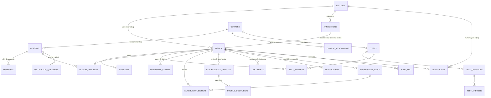

# Model danych

Model projektowany **całościowo na starcie** (iteracja I0) — dokładanie tabel później jest
tanie, przebudowa relacji droga. Nazwy tabel po angielsku (konwencja), opisy po polsku.
Typy i szczegóły kolumn doprecyzuje wykonawca w migracjach; poniżej zakres informacyjny
i relacje, które muszą istnieć.

Zasady przekrojowe:

- każda tabela: `id`, `created_at`, `updated_at`;
- **usuwanie miękkie** (soft delete) wszędzie tam, gdzie rekord jest przywoływany w historii
  (użytkownicy, kursy, lekcje, wpisy stażu…); twarde usuwanie tylko przez procedurę RODO;
- pola wrażliwe (`pesel`, adres) **szyfrowane na poziomie aplikacji**;
- decyzje administracyjne zawsze z parą `decided_by` + `decided_at` i wpisem w `audit_log`;
- pliki: w bazie tylko ścieżka do magazynu obiektowego + metadane, nigdy zawartość.

---

## 1. Diagram głównych relacji (MVP)

## 2. Encje — domena po domenie

### 2.1 Konta i dostęp

**users** — wszystkie osoby w systemie, niezależnie od roli.
`first_name, last_name, email (unikalny), password_hash, phone, address_* (szyfrowane),
pesel (szyfrowane), role (super_admin | project_manager | instructor | volunteer | student),
status (active | blocked), edition_id, access_expires_at (null = bezterminowo),
program_completed_at (null = w trakcie), product_group (psychon | dobrostan | both),
last_login_at, deleted_at`.
Reguły: `access_expires_at` ustawiane przy założeniu konta (+6 mies.); zadanie cykliczne
blokuje materiały po terminie; ukończenie programu zeruje ograniczenie.

**consents** — zgody i akceptacje dokumentów.
`user_id, type (regulamin | polityka | publikacja_profilu | marketing…), document_version,
granted_at, withdrawn_at`. Nigdy nie nadpisywać — wycofanie to nowy stan, nie kasowanie.

**editions** — edycje programu.
`name, starts_at, ends_at, seats_limit, reliability_threshold (domyślnie 60),
test_pass_threshold (80), test_attempts_limit (3), internship_hours_required (72),
supervision_required_count, lesson_completion_percent (60 — próg czasu aktywnego
do ukończenia lekcji; inny niż rzetelność), status (draft | active | closed)`.
Reguły programu trzymane przy edycji, nie w kodzie — zmiana bez programisty (moduł 14.3).

**audit_log** — dziennik działań (moduł 15.2). **Tylko INSERT.**
`actor_id, action (slug), subject_type, subject_id, details (json), created_at`.
Bez `updated_at`, bez soft delete; uprawnienia bazodanowe konta aplikacji bez UPDATE/DELETE
na tej tabeli. Zapis w tej samej transakcji co decyzja.

**sensitive_access_log** — rejestr wglądów w dokumenty wrażliwe (skany dyplomów,
zaświadczenia): `viewer_id, file_type, file_id, viewed_at` (decyzja ⚠️ o zakresie).

### 2.2 Rekrutacja

**applications** — zgłoszenia kandydatów (MVP: wprowadzane/importowane z formularza
zewnętrznego Fundacji).
`edition_id, first_name, last_name, email, phone, source, role (proponowana rola konta),
payload (json — treść zgłoszenia), university, graduation_year, diploma_scan_path
(⚠️ opcjonalnie), status (new | accepted | rejected), rejection_reason, decided_by,
decided_at, user_id (konto założone po akceptacji)`.
Retencja danych odrzuconych kandydatów — decyzja ⚠️ (domyślnie: 3 miesiące, potem anonimizacja).

### 2.3 Kursy i nauka

**courses** — etapy programu i webinary.
`title, slug, description, type (course | webinar), product_group, sequence_order
(pozycja w ścieżce; null = poza sekwencją), edition_id, is_published, deleted_at`.

**lessons** — `course_id, title, description, sequence_order, video_provider_id,
duration_seconds, deleted_at`.

**materials** — `lesson_id (lub course_id), name, file_path, mime, size`.

**course_assignments** — przypisania prowadzących (moduł 5).
`course_id, lesson_id (null = cały kurs; lekcja dziedziczy po kursie), instructor_id,
assigned_by, assigned_at, unassigned_at`.
Reguła: pytanie z lekcji trafia do prowadzącego lekcji, a gdy brak — do prowadzącego kursu.

**instructor_profiles** — wizytówki (moduł 5.1).
`user_id, specializations (json), bio, experience, city, responsibilities (json),
supervisor_id (własny superwizor prowadzącego)`.

**lesson_progress** — postęp i pomiar czasu (moduły 4 i 7).
`user_id, lesson_id, watched_seconds, active_seconds (czas przy aktywnej karcie),
open_count, last_activity_at, is_completed, completed_at` (unikalne `user+lesson`).
Reguły: `active_seconds` rośnie tylko, gdy karta aktywna (raporty z odtwarzacza co ~30 s
+ zdarzenie przy opuszczeniu strony); wartości tylko rosną; ukończenie lekcji wymaga
progu czasu (procent `duration_seconds` — konfigurowalny).

### 2.4 Testy i zaliczenia

**tests** — `course_id (unikalny), pass_threshold (null = wartość edycji — nadpisanie
per kurs), attempts_limit (null = wartość edycji), question_count (10)`.
**test_questions** — `test_id, body, sequence_order`; **test_answers** — `question_id, body,
is_correct`.
**test_attempts** — `user_id, test_id, attempt_number, answers (json: pytanie→odpowiedź),
questions_snapshot (json — treść pytań i odpowiedzi w chwili podejścia; edycja banku
nie zmienia historii), score_percent, passed, created_at`.
Reguły: ocenianie wyłącznie na serwerze; numer podejścia liczony w transakcji; blokada
podejścia ponad limit; wynik z listą błędnych pytań (do ekranu wyniku); po 3. niezaliczeniu
status ustalany procedurą ⚠️ + powiadomienie opiekuna.

**workshop_completions** — warsztat stacjonarny (moduł 6.3).
`user_id, edition_id, completed_at, marked_by`.

**Odblokowanie sekwencyjne (reguła, nie tabela):** kurs `n` w ścieżce jest dostępny, gdy
kurs `n-1` ma komplet lekcji ukończonych **i** zaliczony test. Egzekwowane na serwerze
przy każdym żądaniu treści (nie tylko w UI).

### 2.5 Staż i superwizja

**internship_entries** — dziennik praktyk (moduł 8).
`user_id, date, hours (dziesiętnie), form (dyżur telefoniczny | czat | inna — słownik),
consultations_count, description, status (submitted | accepted | returned),
review_comment, decided_by, decided_at, deleted_at`.
Reguły: do licznika 72 h liczą się wyłącznie `accepted`; przy polu opisu stała nota
o zakazie danych osób konsultowanych; retencja opisów — decyzja ⚠️.

**supervisor_assignments** — `volunteer_id, supervisor_id, assigned_at, unassigned_at`
(historia zmian zachowana).

**supervision_slots** — terminy (moduł 9.2). `supervisor_id, starts_at, duration_minutes,
seats_limit, location_or_link`.

**supervision_signups** — `slot_id, user_id, signed_up_at, cancelled_at,
attendance (null | present | absent), attendance_marked_by`.
Reguły: zapis tylko na termin własnego superwizora; licznik obecności do warunku certyfikatu.

### 2.6 Certyfikaty i dokumenty

**certificates** — moduł 10.
`user_id, edition_id, number (ciągły w edycji, format np. NP/2026/001 — sekwencja per
edycja w transakcji), issued_at, pdf_path, verification_token (do QR),
conditions_snapshot (json — stan warunków w chwili wydania),
revoked_at, revoked_reason (unieważnienie — moduł 10.4)`.
Weryfikacja publiczna: po `number` (wyszukiwarka) i po tokenie z QR; zakres pokazywanych
danych — decyzja ⚠️.

**documents** — moduł 11. `user_id, edition_id (numeracja per typ i edycja),
type (volunteer_agreement | internship_certificate), number, data_snapshot (json — dane
z profilu w chwili generowania), pdf_path, generated_at,
signature_status (none | signed_offline | e_signed)`.
Dostęp: właściciel + administracja; nigdy publiczny link.

### 2.7 Profil psychologa

**psychologist_profiles** — moduł 12.
`user_id (unikalny), specializations (json), approach (nurt), city, bio,
publication_consent_at, status (draft | submitted | returned | accepted | published |
withdrawn), return_reason, decided_by, decided_at, published_at, external_id
(identyfikator w bazie zewnętrznej — faza 2)`.
Reguły: formularz dostępny dopiero po spełnieniu warunków ukończenia programu; po złożeniu
edycja zablokowana do decyzji.

**profile_documents** — załączniki weryfikacyjne. `profile_id, type (dyplom |
niekaralnosc | inne), file_path, uploaded_at`. Dostęp ograniczony + wpis
w `sensitive_access_log`; szyfrowanie at-rest.

### 2.8 Komunikacja

**notifications** — dzwonek (moduł 13.1). `user_id, type, title, body, link, read_at`.
**emails** — skrzynka wysłanych (moduł 13.2). `to_email, to_user_id, subject, body_html,
status (queued | sent | failed | simulated), related_type/related_id, sent_at`.
**instructor_questions** — pytania z lekcji (moduł 13.3). `user_id, lesson_id,
question, answer, answered_by, answered_at`.

### 2.9 Ustawienia

**settings** — klucz→wartość dla flag i konfiguracji globalnej (moduł sprzedaży off,
progi domyślne, adresy stron Fundacji). Wartości specyficzne dla edycji — w `editions`.

## 3. Decyzja projektowa: wiele edycji równolegle (⚠️)

Model **od początku** wiąże uczestników, zgłoszenia, certyfikaty i warsztaty z `edition_id`
— to koszt bliski zeru teraz, a umożliwia równoległe edycje bez migracji danych.
Decyzja ⚠️ dotyczy wyłącznie **interfejsu** (przełącznik edycji w panelu, filtry) —
podejmowana przed I6.

## 4. Faza 2 — tabele dokładane bez przebudowy

| Domena | Tabele | Uwagi |
|---|---|---|
| Wydarzenia na żywo (M18) | `events`, `event_signups` | typ dostępu: imienny / program / publiczny; obecność; nagranie po spotkaniu (link do `courses` typu webinar) |
| DOBROstan (M19) | `subscriptions`, `subscription_payments`, `monthly_themes`, `challenges` | `product_group` w `users`/`courses` istnieje od MVP |
| Mailing (M19) | `mailing_contacts`, `mailing_tags`, `mailing_contact_tags`, `mailing_messages` | zgody marketingowe w `consents` |
| Współpraca (M20) | `collaboration_requests` | formy współpracy, historia odpowiedzi HR |
| Integracja profili (M12) | kolumny `external_id`, `sync_status` + `profile_sync_log` | po decyzjach ⚠️ |

## 5. Retencja danych (propozycja do zatwierdzenia z prawnikiem)

| Dane | Okres | Po upływie |
|---|---|---|
| zgłoszenia odrzucone | 3 mies. od decyzji (⚠️) | anonimizacja |
| skany dyplomów kandydatów | do decyzji + 30 dni (⚠️), o ile w ogóle na serwerze | usunięcie pliku |
| opisy dyżurów stażowych | koniec edycji + 12 mies. (⚠️) | usunięcie treści opisu, liczby zostają |
| dokumenty (umowy) | wymóg prawny (5 lat) | archiwizacja |
| dziennik działań | 5 lat (⚠️) | archiwizacja poza aplikacją |
| konta nieaktywne po wygaśnięciu | 12 mies. | anonimizacja po powiadomieniu |
| certyfikaty (numer + imię i nazwisko) | bezterminowo | — (podstawa: weryfikacja publiczna) |
